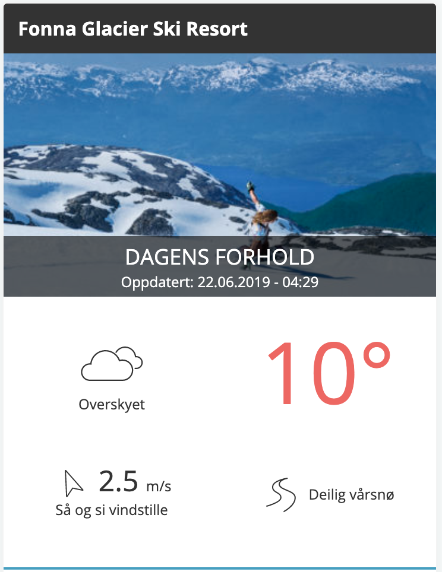

# Dekode Backend Developer Case

In order for Dekode to qualify Developers we kindly ask our candidates to perform a test
case to present for us. The test case is your opportunity to display your skills, and a way for
us to verify that your skill set is matching the role you have interviewed for. The case is
delivered with links to an API documentation and an illustration / screenshot of output we
would like to see from the data fetched from the API.

## Qualities we look for are:
- Your understanding of the case
- Code structure and quality
- Data structure
- Solution

## The assignment:

### 1. Gutenberg
Create a WordPress plugin that enables a user in the administration panel to insert a block in a post / page to present data from a ski resort using the Fnugg API (https://api.fnugg.no/).  

Your plugin should be displayed as a Gutenberg block the post/ page editor where you allow the user to search for a resort with autocomplete (example queries below): https://api.fnugg.no/suggest/autocomplete/?q=fonna  

To be able to fetch the resort details requires another service call: https://api.fnugg.no/search?q=fonna  

Note that which fields you would like the service to return can be specified using a sourceFields parameter, example: https://api.fnugg.no/search?q=Hafjell%20Alpinsenter&sourceFields=name,description,lifts.count,lifts.open  

### 2. API middleware
Create a PHP class that handles all REST API calls that you use as a middleware between WordPress and the Fnugg API for retrieving data and processing the data you need in order to populate the Gutenberg block.

- Tip: Use the built in WP functions to call external endpoints eg:
wp_remote_get:
(https://developer.wordpress.org/reference/functions/wp_remote_get/)
- Bonus: Filter the data from the REST response and return only the required
fields
- Add a cache handler in your REST API class

Based on the response from the API for the selected resort insert a block in the post content that presents the data fields displayed in the screenshot below for the selected resort, it is not a requirement that the output looks like the attached screenshot:

## Delivery
When you are done commit to this repository and write henning@dekode.no or whoever you were in contact with when you received the assignment.

*Good luck!*
*Henning Hovland CTO, Dekode*
